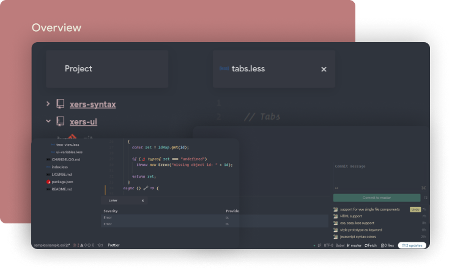
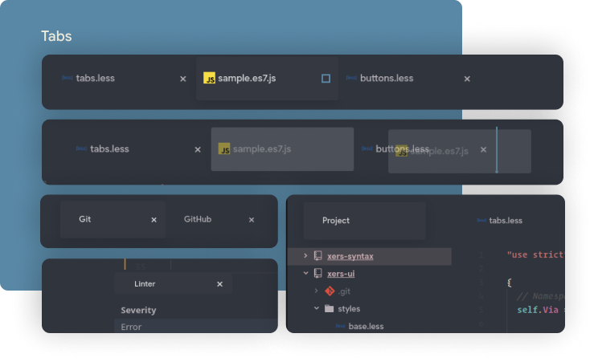
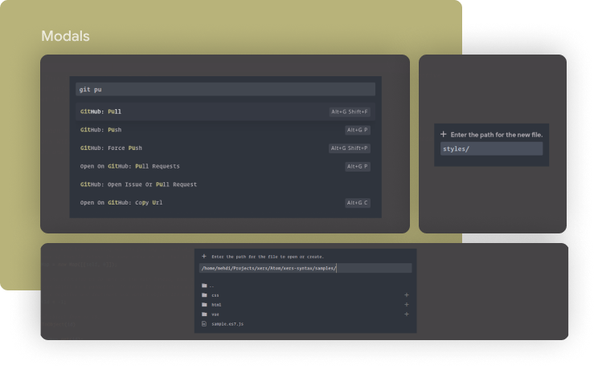
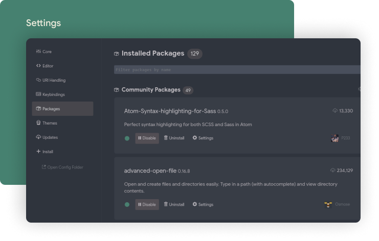

# xers: the Atom UI theme
__xers__  🐻 means bear; and here is a UI theme so simple and clean, that it actually pushes the interface out of your way, for the sake of more focus on code 👨🏻‍💻👩🏻‍💻

Install the matching [_xers: the Atom syntax theme_](https://atom.io/themes/xers-syntax)

# 🖍 Color palette

# 😗 Interface

# ㊗ Typography
I recommend using Google Sans. you can download it from [cufonfonts](https://www.cufonfonts.com/font/google-sans).

# 🐛 Issues
Fee free to report issues/bugs, feature requests and suggestions for improvements in [GitHub](https://github.com/xers-themes/xers-Atom-UI/issues).
